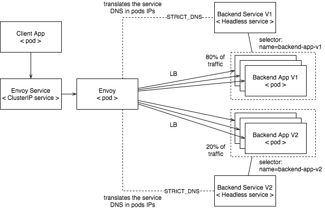

# Envoy Kubernetes Traffic Splitting Lab

To explore this lab you should have a k8s cluster installed and understand the
basics of Kubernetes (Deployments, Pods, Services, etc). To start a cluster
locally you can try [Minikube](https://kubernetes.io/docs/tasks/tools/install-minikube/).

## Goal

Enable intra-cluster service to service communication using Envoy’s router to
split traffic to a route in a virtual host across two or more upstream backends.

The main use case we want to achieve is version upgrades where traffic to a
route is shifted gradually from one backend to another.

## How it works

In this set up we are using Envoy as a reverse-proxy in front of a backend
application. This application is configured to deploy 3 replicas and the load balancing
across the multiple instances is done via Envoy using a [headless sercice](https://kubernetes.io/docs/concepts/services-networking/service/#headless-services) for
service discovery. This headless service, instead of providing load balancing or
proxying as usual, modifies the DNS configuration to return records (addresses) that point
directly to the Pods backing the Service. In the Envoy side we use the [Strict DNS](https://www.envoyproxy.io/docs/envoy/latest/intro/arch_overview/upstream/service_discovery#arch-overview-service-discovery-types-strict-dns)
service discovery type.

Now we can add another upstream backend to represent a v2 of the backend app and
configure Envoy to [split the traffic](https://www.envoyproxy.io/docs/envoy/latest/configuration/http/http_conn_man/traffic_splitting.html) across the two versions.



## Exploring

Let's start by installing the backend apps.

```bash
$ kubectl create ns backend
$ kubectl apply -f backend-app.yaml
```

This yaml configuration will install two deployment controllers and two headless
services, one for each version of the backend app. Note that the headless service
is defined by the `clusterIP: None` parameter. These apps do nothing but output
some information about the HTTP request and pod environment.

List the pods you have just deployed. You should see 6 pods in a Running status:

```bash
$ kubectl get po -n backend
NAME                              READY   STATUS    RESTARTS   AGE
backend-app-v1-78db44c49d-59v5m   1/1     Running   0          107m
backend-app-v1-78db44c49d-7ntqn   1/1     Running   0          107m
backend-app-v1-78db44c49d-tfkhs   1/1     Running   0          107m
backend-app-v2-56b85cc44d-44ksb   1/1     Running   0          107m
backend-app-v2-56b85cc44d-ffbxh   1/1     Running   0          107m
backend-app-v2-56b85cc44d-wmdqr   1/1     Running   0          107m
```

List the services:

```bash
$ kubectl get svc -n backend
NAME             TYPE        CLUSTER-IP   EXTERNAL-IP   PORT(S)   AGE
backend-app-v1   ClusterIP   None         <none>        80/TCP    109m
backend-app-v2   ClusterIP   None         <none>        80/TCP    109m
```

Let's see how the headless service works. Create a temporary pod to query the
backend app service:

```bash
$ kubectl run -i --tty --image busybox:1.28 client-app --restart=Never --rm
```

From inside that pod run:

```bash
$ nslookup backend-app-v1.backend.svc.cluster.local
Server:    10.0.0.10
Address 1: 10.0.0.10 kube-dns.kube-system.svc.cluster.local

Name:      backend-app-v1.backend.svc.cluster.local
Address 1: 10.20.2.47
Address 2: 10.20.1.50
Address 3: 10.20.0.40

```

Just for tests purposes, access one of the IPs returned in the `nslookup`

```bash
wget -qO- 10.20.0.40:8080 | grep Hostname
Hostname: backend-app-v1-78db44c49d-7ntqn
```

Now open a new tab or simply run from your terminal session (not from the 
temporary client pod we created before):

```bash
$ kubectl describe svc backend-app-v1 -n backend
Name:              backend-app-v1
Namespace:         backend
Labels:            <none>
Annotations:       ...
Selector:          name=backend-app-v1
Type:              ClusterIP
IP:                None
Port:              http  80/TCP
TargetPort:        8080/TCP
Endpoints:         10.20.0.40:8080,10.20.1.50:8080,10.20.2.47:8080
Session Affinity:  None
Events:            <none>
```

See the endpoints and compare with the result of the `nslookup`.

It's time to deploy Envoy:

```bash
$ kubectl apply -f envoy.yaml
```

This yaml file contains the Envoy configuration deployed as a `ConfigMap`, the
deployment controller responsible to deploy the Envoy pod and a `ClusterIP` service to
expose the Envoy pod to other applications deployed to the same cluster. (Notice
that there is no restrictions to expose this pod to traffic from outside
the cluster using an Ingress or LoadBalancer - it's just not our focus here)

Check your Envoy pod:

```bash
$ kubectl get po -n backend -l name=backend-envoy
NAME                             READY   STATUS    RESTARTS   AGE
backend-envoy-559c97f657-grzv5   1/1     Running   0          108m
```

Go back to the terminal session that is running the temporary client pod and run:

```bash
$ wget -qO- backend-envoy.backend.svc.cluster.local | grep Hostname
Hostname: backend-app-v1-78db44c49d-7ntqn
```

Notice that each time you run this command you get a different pod and, eventually,
you'll see a pod from the v2 backend.

You may also try this:

```bash
$ for i in $(seq 1 1000); do wget -qO- backend-envoy.backend.svc.cluster.local | grep Hostname; done > output
$ grep v1 output | wc -l
807
$ grep v2 output | wc -l
193
```

https://kubernetes.io/docs/concepts/services-networking/service/#headless-services
https://www.envoyproxy.io/docs/envoy/latest/configuration/http/http_conn_man/traffic_splitting.html
https://www.envoyproxy.io/docs/envoy/latest/intro/arch_overview/upstream/service_discovery#arch-overview-service-discovery-types-strict-dns
